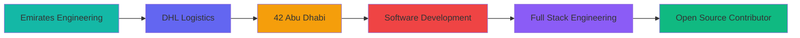

# Hi there! 👋 I'm Nauman Munir

<div align="center">
  
</div>

## 🚀 About Me

I'm a passionate **Software Developer** and **Full Stack Engineer** with a unique journey through cybersecurity, system programming, and modern web development. Currently sharpening my skills at **42 Abu Dhabi**, where I'm diving deep into low-level programming and software engineering fundamentals.

- 🎓 **Student at 42 Abu Dhabi** - Mastering C/C++, algorithms, and system programming
- 💼 **Former DHL Employee of the Month** - Led process improvements and staff dashboard development
- ✈️ **Emirates Engineering Background** - Bringing precision and attention to detail from aviation
- 🔐 **Cybersecurity Enthusiast** - Multiple certifications including TryHackMe achievements
- 🌱 **Currently Learning**: Advanced React patterns, system design, and distributed systems
- 🎯 **2025 Goals**: Contribute to open source, master DevOps, and build impactful projects

🌐 **[Explore My Complete Portfolio](https://portfolio-nauman.netlify.app/)** - Detailed project showcases, experience timeline, and achievements

---

## 🎯 Project Highlights

<div align="center">

<table>
<tr>
<td width="50%">

### 🎮 **Cub3D - Raycasting Engine**
*Advanced graphics programming project*

- **Tech**: C, MLX, Mathematics
- **Features**: 3D rendering, texture mapping
- **Achievement**: Complex algorithm implementation
- **[🔗 Portfolio Details](https://portfolio-nauman.netlify.app/dynamic-detail.html?project=cub3d)**

</td>
<td width="50%">

### 📊 **DHL Staff Dashboard**
*Employee of the Month project*

- **Tech**: React, Charts.js, Analytics
- **Impact**: Improved team performance tracking
- **Recognition**: Led to Employee of the Month award
- **[🔗 Portfolio Details](https://portfolio-nauman.netlify.app/dynamic-detail.html?project=dhl_dashboard)**

</td>
</tr>
<tr>
<td width="50%">

### 🔄 **ft_transcendence**
*Advanced full-stack application*

- **Tech**: JavaScript, Django, WebSocket
- **Features**: Real-time game, chat, tournaments
- **Status**: Currently in development
- **[🔗 Portfolio Details](https://portfolio-nauman.netlify.app/dynamic-detail.html?project=ft_transcendence)**

</td>
<td width="50%">

### 🖥️ **Custom HTTP Server**
*From-scratch implementation*

- **Tech**: C++, HTTP/1.1, Socket Programming
- **Features**: Multi-client, CGI support
- **Learning**: Network programming mastery
- **[🔗 Portfolio Details](https://portfolio-nauman.netlify.app/dynamic-detail.html?project=webserv)**

</td>
</tr>
</table>

**[🚀 View All 15+ Projects](https://portfolio-nauman.netlify.app/project.html)**

</div>

---

## 🛠️ Tech Stack & Tools

<div align="center">

### Languages


### Frontend & Frameworks


### Databases & Cloud


### Cybersecurity & Tools


</div>

---

## 🏆 Achievements & Certifications

<div align="center">

| 🎖️ **Professional Certifications** | 🏅 **Recognition** |
|:---:|:---:|
| 🔐 **Advent of Cyber 2024** - TryHackMe | 🌟 **DHL Employee of the Month** |
| 🛡️ **Cybersecurity Fundamentals** | 🎯 **42 Piscine Survivor** |
| 🌐 **Web Development Bootcamp** | ⚡ **Process Improvement Leader** |
| ⚛️ **React Complete Guide 2025** | 🚀 **Staff Dashboard Creator** |

</div>

---

## 📊 GitHub Stats

<div align="center">
  


</div>

---

## 🚀 Featured Projects

<div align="center">

### 🏆 **42 School Projects**

| Project | Description | Tech Stack | Live Demo |
|---------|-------------|------------|-----------|
| 🎮 **[Cub3D](https://github.com/NomanMunir/cub3d)** | Raycasting game engine inspired by Wolfenstein 3D | `C` `MLX` `Mathematics` | [View Details](https://portfolio-nauman.netlify.app/dynamic-detail.html?project=cub3d) |
| 🔄 **[ft_transcendence](https://github.com/NomanMunir/ft_transcendence)** | Real-time Pong game with chat & tournaments | `JavaScript` `Django` `WebSocket` | [View Details](https://portfolio-nauman.netlify.app/dynamic-detail.html?project=ft_transcendence) |
| 🖥️ **[Webserv](https://github.com/NomanMunir/webserv)** | HTTP server implementation from scratch | `C++` `HTTP` `Socket Programming` | [View Details](https://portfolio-nauman.netlify.app/dynamic-detail.html?project=webserv) |
| 🧠 **[Philosophers](https://github.com/NomanMunir/philosophers)** | Dining philosophers problem with threading | `C` `Threads` `Mutexes` | [View Details](https://portfolio-nauman.netlify.app/dynamic-detail.html?project=philosophers) |
| 🐚 **[Minishell](https://github.com/NomanMunir/minishell)** | Custom shell with command parsing & execution | `C` `Shell` `Parser` | [View Details](https://portfolio-nauman.netlify.app/dynamic-detail.html?project=minishell) |

### 💼 **Professional Projects**

| Project | Description | Tech Stack | Portfolio Link |
|---------|-------------|------------|----------------|
| 📊 **[DHL Staff Dashboard](https://github.com/NomanMunir/dhl-dashboard)** | Performance tracking & analytics dashboard | `React` `Charts.js` `Dashboard` | [View Details](https://portfolio-nauman.netlify.app/dynamic-detail.html?project=dhl_dashboard) |
| 🏕️ **[YelpCamp](https://github.com/NomanMunir/yelpcamp)** | Full-stack campground review platform | `Node.js` `Express` `MongoDB` | [View Details](https://portfolio-nauman.netlify.app/dynamic-detail.html?project=yelp_camp) |
| 🔐 **[Born2beroot](https://github.com/NomanMunir/born2beroot)** | Secure virtual server environment setup | `Linux` `VirtualBox` `Security` | [View Details](https://portfolio-nauman.netlify.app/dynamic-detail.html?project=born2beroot) |

### 🎯 **Current Focus**
- 🚀 **[ft_transcendence](https://github.com/NomanMunir/ft_transcendence)** - Advanced full-stack web application (In Progress)
- 🛠️ **Open Source Contributions** - Contributing to developer community projects
- 📚 **System Design** - Learning scalable architecture patterns

**[🌐 View All Projects in Portfolio](https://portfolio-nauman.netlify.app/project.html)**

</div>

---

## 🌟 What Makes Me Unique

```javascript
const nauman = {
    background: ["Aviation Engineering", "Logistics", "Software Development"],
    currentFocus: "42 School - System Programming & Algorithms",
    passions: ["Problem Solving", "Clean Code", "Continuous Learning"],
    
    workStyle: {
        approach: "Detail-oriented with aviation precision",
        collaboration: "Team player with leadership experience",
        learning: "Always curious, never satisfied with 'good enough'"
    },
    
    funFacts: [
        "🎯 Survived the intense 42 Piscine",
        "📈 Improved DHL processes as Employee of the Month",
        "🔍 Love solving complex algorithmic challenges",
        "🌍 Bringing aviation precision to software development"
    ]
};
```

---

## 📈 My Journey

<div align="center">



</div>

**From Aviation to Code**: My journey started in **Emirates Engineering**, where I learned the importance of precision and attention to detail. At **DHL**, I discovered my passion for process optimization and earned **Employee of the Month** recognition. Now at **42 Abu Dhabi**, I'm applying that same dedication to mastering software engineering fundamentals.

---

## 🎯 Current Goals & Future Vision

### 🚀 **2025 Roadmap**

- [ ] **Complete 42 Common Core** - Master system programming fundamentals
- [ ] **Open Source Contributions** - Give back to the developer community  
- [ ] **DevOps Mastery** - Learn Kubernetes, CI/CD, and cloud infrastructure
- [ ] **Full Stack Projects** - Build impactful applications solving real problems
- [ ] **Technical Leadership** - Mentor other developers and lead technical initiatives

### 🌟 **Long-term Vision**

I envision myself as a **Senior Software Engineer** who bridges the gap between complex technical systems and practical business solutions. My goal is to create software that not only works flawlessly but also makes a meaningful impact on users' lives.

---

## 📫 Let's Connect!

<div align="center">

[](https://portfolio-nauman.netlify.app/)
[](https://portfolio-nauman.netlify.app/experience.html)
[](https://portfolio-nauman.netlify.app/project.html)
[](https://portfolio-nauman.netlify.app/certificates.html)

[](https://www.linkedin.com/in/nomanmunir/)
[](mailto:nauman.munir@protonmail.com)
[](https://github.com/NomanMunir)

### 🎯 **Quick Portfolio Navigation**
- 🏢 **[42 Abu Dhabi Experience](https://portfolio-nauman.netlify.app/42-experience.html)** - My journey at 42 School
- 📦 **[DHL Experience](https://portfolio-nauman.netlify.app/dhl-experience.html)** - Employee of the Month achievements
- ✈️ **[Emirates Experience](https://portfolio-nauman.netlify.app/emirates-experience.html)** - Aviation engineering background
- 🎯 **[Goals & Vision](https://portfolio-nauman.netlify.app/reflection.html)** - Future aspirations and roadmap

</div>

---

<div align="center">

### 💭 *"Code is like humor. When you have to explain it, it's bad."* - Cory House

**Thanks for visiting my profile! Feel free to explore my repositories and don't hesitate to reach out if you'd like to collaborate on something amazing! 🚀**


</div>

---

<div align="center">
  


**Let's build something incredible together! 💻✨**

</div>
